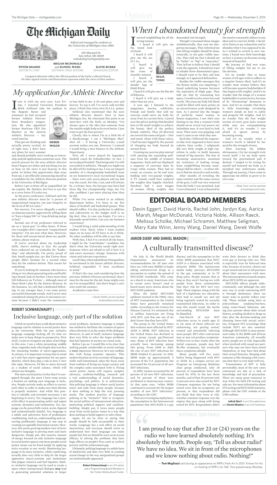
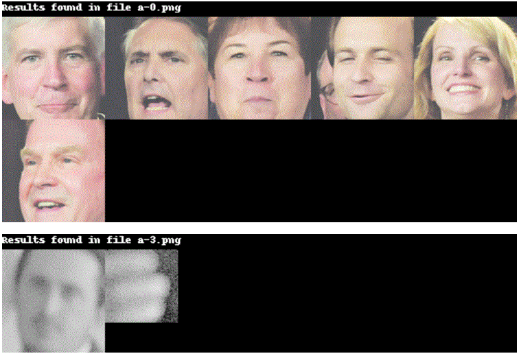

# Project 1. Wildfire Prediction App (In progress)
*Project Overview*
1. Scrap and join big datasets (>100GB) via Google Engine API and satellite remote sensors into PostgreSQL
2. Multivariate Analysis and feature engineering with data mining techniques using PySpark and AWS
3. Modeling imbalanced fire occurence datasets on various classification algorithms (Random Forest, Neural Newtorks, SVM, etc)
4. User Interface to build chloropleth maps of high fire risk areas using D3

# [Project 2. Trading Agent for Stock Market](https://github.com/joannayhe/Wenjiao_Portfolio/tree/master/Trading_Strategy)
*Project Overview*
1. Historical data cleaning and time-series analysis with Numpy and Pandas
2. Develop and implemented reinforcement learning algorithms to train historical data 
3. Create trading agent which based on historical data to predict future prices and automatically execute trading strategies to achieve best portfolio return (1.6% to 4.6% portfolio return after one year of trading)
4. Implementing the trading agent by Python

 
 

# [Project 3. Database for Adoption Center](https://github.com/joannayhe/Wenjiao_Portfolio/tree/master/Adoption_Center)
*Project Overview*
1. Designed Information Flow Diagram (IFD) and Enhanced Entity-Relationship (EER) Diagram for the adoption center
2. Wrote SQL to implement the logic on the database. Including login, register, add new data, query data from database, etc.
3. Design and implement the front end UI and back end database by Python Flask and MySQL.

 
 

# [Project 4. Search Keywords and Faces from Newspaper Images](https://github.com/joannayhe/Wenjiao_Portfolio/tree/master/face_recognition)
*Project Overview*
1. Input a keyword and search through the newspaper images for the occurrences of keywords and faces
2. The result shoule return a contact sheet of all of the faces which were located on the newspaper page which mentions the imput keyword (implement by OpenCV, PIL)

 

