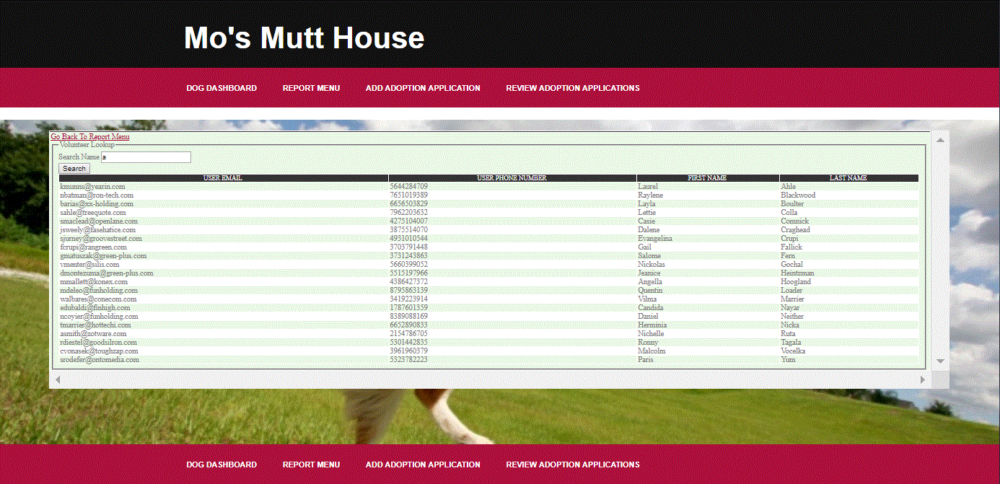

# [Project 1. Trading Agent for Stock Market](https://github.gatech.edu/whuang98/ML4T/tree/master/ML4T_2020Spring/strategy_evaluation)
*Project Overview*
1. Do stock historical data cleaning by Numpy and Pandas
2. Using reinforcement learning algorithms to train historical data 
3. Create trading agent which based on historical data to predict future prices and make trading strategies to achieve best portfolio (matplotlib)
4. Implementing the trading agent by Python

 
 

# [Project 2. Database for Adoption Center](https://github.gatech.edu/whuang98/ML4T/tree/master/ML4T_2020Spring/strategy_evaluation)
*Project Overview*
1. Designed Information Flow Diagram (IFD) and Enhanced Entity-Relationship (EER) Diagram for the adoption center
2. Wrote SQL to implement the logic on the database. Including login, register, add new data, query data from database, etc.
3. Design and implement the front end UI and back end database by Python and MySQL.

 
 

# Project 3. Search Keywords and Faces from Newspaper Images
*Project Overview*
1. Input a keyword and search through the newspaper images for the occurrences of keywords and faces
2. The result shoule return a contact sheet of all of the faces which were located on the newspaper page which mentions the imput keyword (implement by OpenCV, PIL)

 

